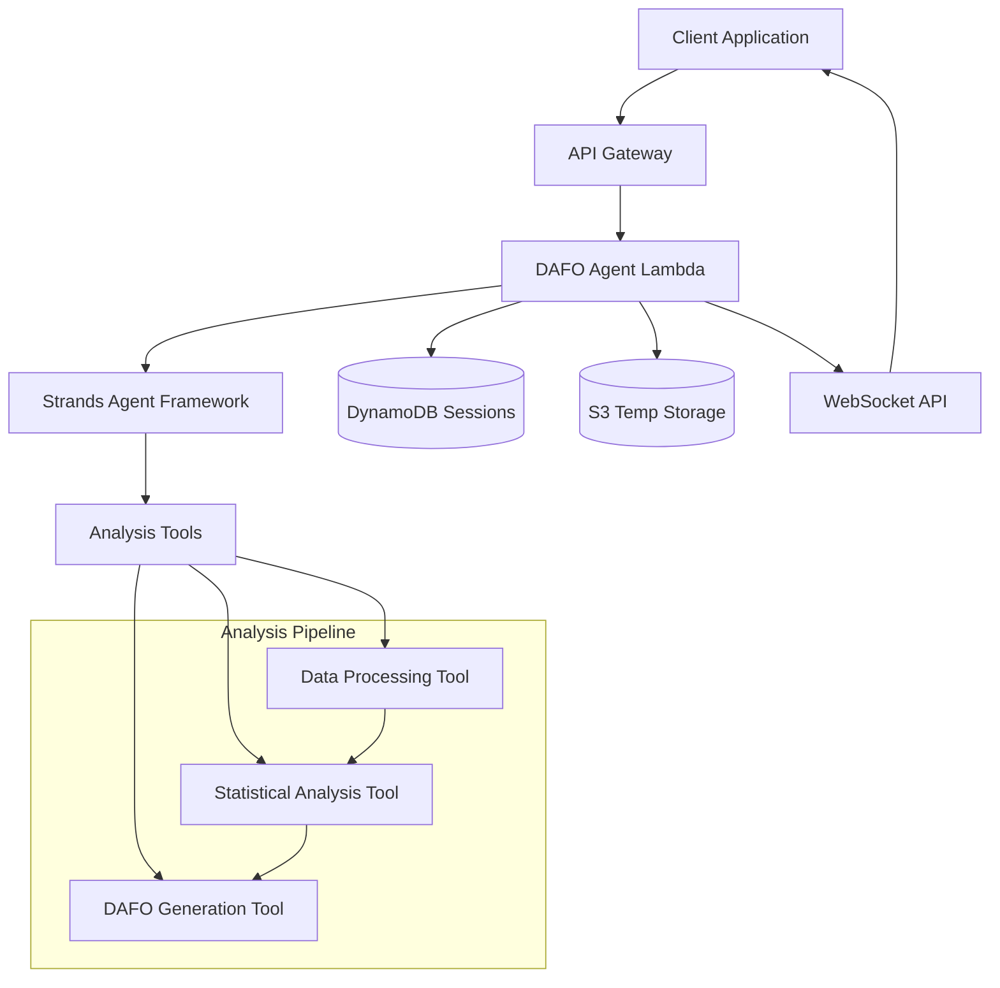

# Design Document

## Overview

The DAFO Analytics Agent is a specialized Strands-based AI agent that performs comprehensive data analysis and generates strategic DAFO (Debilidades, Amenazas, Fortalezas, Oportunidades) reports. The agent integrates with the existing Gen AI Service infrastructure, leveraging Python 3.12 runtime, DynamoDB for session management, and WebSocket APIs for real-time communication.

The agent follows a multi-stage analysis pipeline: data ingestion → preprocessing → statistical analysis → AI-powered categorization → DAFO report generation. It supports multiple data formats and provides customizable analysis parameters for industry-specific insights.

## Architecture

### High-Level Architecture



### Component Architecture

The agent consists of three main layers:

1. **API Layer**: REST endpoints for data submission and WebSocket for real-time updates
2. **Agent Layer**: Strands agent with specialized tools for data analysis
3. **Storage Layer**: DynamoDB for sessions, S3 for temporary data storage

### Data Flow

1. Client submits data via REST API
2. Agent validates and preprocesses data
3. Statistical analysis extracts key metrics and patterns
4. AI categorizes findings into DAFO elements
5. Structured report is generated and returned
6. Progress updates sent via WebSocket throughout the process

## Components and Interfaces

### 1. DAFO Agent Core

**Location**: `src/python/agents/dafo_agent.py`

```python
class DAFOAgent:
    """Main agent class using Strands framework"""
    
    def __init__(self):
        self.agent = Agent(
            model="us.anthropic.claude-3-7-sonnet-20250219-v1:0",
            tools=[data_processor, statistical_analyzer, dafo_generator],
            system_prompt="DAFO analysis specialist prompt"
        )
    
    async def analyze_data(self, data: dict, params: dict) -> dict:
        """Main analysis entry point"""
        pass
```

### 2. Data Processing Tool

**Location**: `src/python/agents/tools/data_processor.py`

```python
@tool
def data_processor(data: str, format_type: str) -> dict:
    """
    Process and validate input data for analysis
    
    Args:
        data: Raw input data (JSON, CSV, or text)
        format_type: Data format identifier
        
    Returns:
        dict: Processed and structured data
    """
```

### 3. Statistical Analysis Tool

**Location**: `src/python/agents/tools/statistical_analyzer.py`

```python
@tool
def statistical_analyzer(processed_data: dict, analysis_params: dict) -> dict:
    """
    Perform statistical analysis on processed data
    
    Args:
        processed_data: Cleaned and structured data
        analysis_params: Analysis configuration parameters
        
    Returns:
        dict: Statistical insights and metrics
    """
```

### 4. DAFO Generation Tool

**Location**: `src/python/agents/tools/dafo_generator.py`

```python
@tool
def dafo_generator(analysis_results: dict, context_params: dict) -> dict:
    """
    Generate DAFO analysis from statistical results
    
    Args:
        analysis_results: Output from statistical analysis
        context_params: Industry and customization parameters
        
    Returns:
        dict: Structured DAFO report
    """
```

### 5. Lambda Handler

**Location**: `src/python/agents/dafo_handler.py`

```python
def lambda_handler(event, context):
    """AWS Lambda entry point for DAFO agent"""
    
    # Handle different event types:
    # - REST API requests for analysis
    # - WebSocket connection management
    # - Progress update notifications
```

### 6. API Endpoints

**REST API Endpoints**:
- `POST /dafo/analyze` - Submit data for analysis
- `GET /dafo/history/{user_id}` - Retrieve analysis history
- `GET /dafo/report/{analysis_id}` - Get specific analysis report

**WebSocket Events**:
- `analysis_started` - Analysis initiation
- `progress_update` - Processing progress
- `analysis_complete` - Final results
- `error_occurred` - Error notifications

## Data Models

### Analysis Request Model

```python
class AnalysisRequest:
    data: Union[str, dict, list]  # Input data
    format_type: str              # "json", "csv", "text"
    industry_context: Optional[str]
    custom_keywords: Optional[List[str]]
    analysis_depth: str           # "basic", "detailed", "comprehensive"
    user_id: str
    session_id: str
```

### DAFO Report Model

```python
class DAFOReport:
    analysis_id: str
    timestamp: datetime
    debilidades: List[DAFOElement]    # Weaknesses
    amenazas: List[DAFOElement]       # Threats
    fortalezas: List[DAFOElement]     # Strengths
    oportunidades: List[DAFOElement]  # Opportunities
    confidence_score: float
    data_summary: dict
    analysis_parameters: dict

class DAFOElement:
    description: str
    supporting_data: List[str]
    confidence_score: float
    category_tags: List[str]
```

### Session Model

```python
class AnalysisSession:
    session_id: str
    user_id: str
    status: str  # "pending", "processing", "completed", "error"
    created_at: datetime
    updated_at: datetime
    progress_percentage: int
    current_stage: str
    websocket_connection_id: Optional[str]
```

## Error Handling

### Error Categories

1. **Data Validation Errors**
   - Invalid format detection
   - Missing required fields
   - Data size limitations

2. **Processing Errors**
   - Statistical analysis failures
   - AI model timeouts
   - Memory limitations

3. **Infrastructure Errors**
   - DynamoDB connection issues
   - S3 storage failures
   - WebSocket disconnections

### Error Response Format

```python
class ErrorResponse:
    error_code: str
    error_message: str
    error_details: dict
    recovery_suggestions: List[str]
    timestamp: datetime
```

### Retry Strategy

- Exponential backoff for transient failures
- Circuit breaker pattern for external service calls
- Graceful degradation for non-critical features

## Testing Strategy

### Unit Testing

- **Tool Testing**: Individual tool functions with mock data
- **Data Processing**: Validation logic and format handling
- **DAFO Generation**: AI categorization accuracy
- **Error Handling**: Exception scenarios and edge cases

### Integration Testing

- **End-to-End Workflows**: Complete analysis pipeline
- **WebSocket Communication**: Real-time update delivery
- **Database Operations**: Session management and data persistence
- **API Contract Testing**: Request/response validation

### Performance Testing

- **Load Testing**: Multiple concurrent analysis requests
- **Memory Usage**: Large dataset processing
- **Response Time**: Analysis completion benchmarks
- **WebSocket Scalability**: Connection handling limits

### Test Data Sets

- **Sample Business Data**: Financial metrics, customer data
- **Industry-Specific Data**: Different business contexts
- **Edge Cases**: Malformed data, empty datasets
- **Multilingual Content**: Spanish and English text analysis

## Security Considerations

### Data Protection

- Temporary data storage with automatic cleanup
- Encryption at rest for sensitive business data
- No persistent storage of raw input data

### Access Control

- User authentication via existing API Gateway
- Session-based access to analysis results
- Rate limiting for analysis requests

### Compliance

- GDPR compliance for EU business data
- Data retention policies (90 days maximum)
- Audit logging for analysis activities